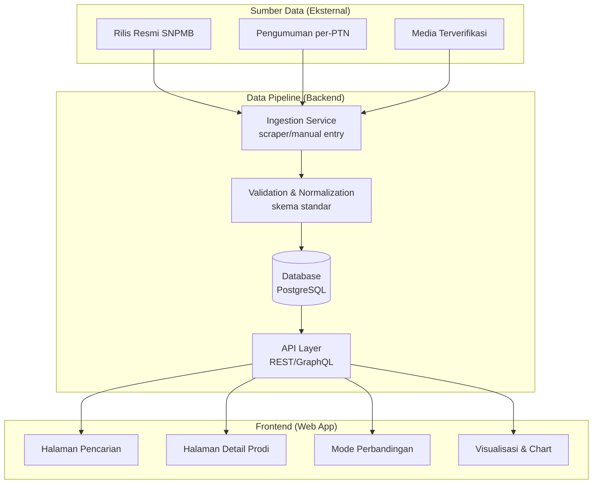
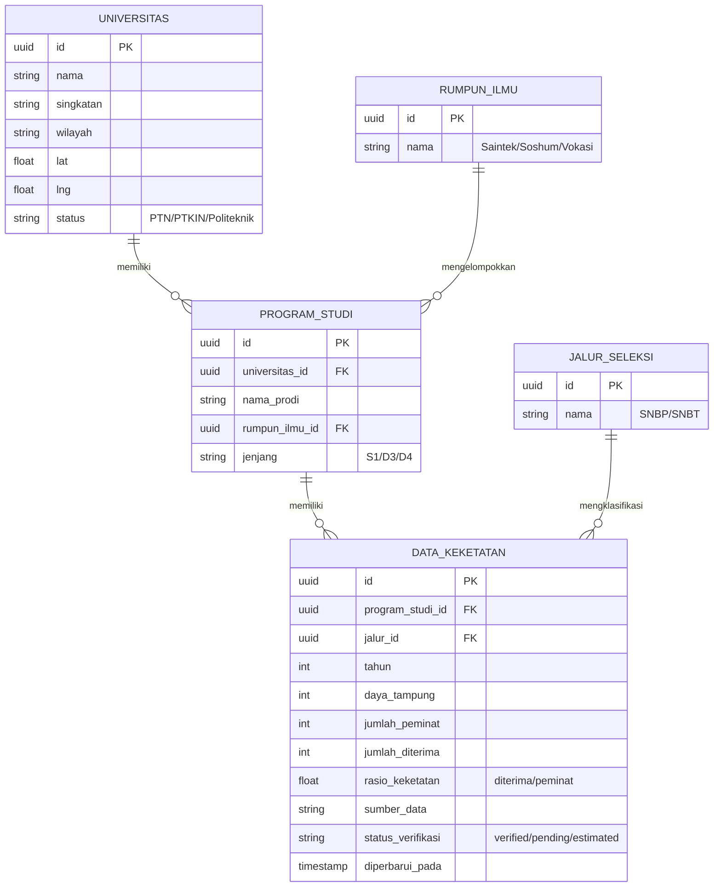

# PRD & SDD : Portal Keketatan SNPMB (SNBP & SNBT) per PTN

**Dokumen:** Product Requirements Document (PRD) + Software/System Design Document (SDD)
**Produk:** Portal Keketatan SNPMB : *Cek Peluangmu*
**Versi:** 1.0 (Draft)
**Status:** Proposed
**Penyusun konteks:** Rofiq Syaifurrohman (Teknik Informatika, UNSIQ Wonosobo)
**Skill/framework rujukan:** `web-artifacts-builder`, `design:design-system`, `engineering:architecture`, `product-management:write-spec`

---

## 0. Analisis Awal (Ringkasan Eksekutif)

### 0.1 Konteks Domain
SNPMB (Seleksi Nasional Penerimaan Mahasiswa Baru) mengelola dua jalur masuk PTN di Indonesia:

| Jalur | Dasar Seleksi | Sifat Data "Keketatan" |
|---|---|---|
| **SNBP** (Seleksi Nasional Berdasarkan Prestasi) | Nilai rapor + prestasi, tanpa tes | Rasio *pendaftar : diterima* per prodi per PTN, diumumkan resmi tiap tahun |
| **SNBT** (Seleksi Nasional Berdasarkan Tes) | Skor UTBK | Rasio *peserta : diterima* per prodi per PTN + sebaran skor UTBK |

**Insight riset awal** (hasil pengecekan data publik terbaru, sebagai acuan validitas domain : bukan sumber data produksi):
- Keketatan dihitung sebagai `diterima / peminat`, dan sangat bervariasi antar prodi (dari ~1% pada prodi favorit hingga >50% pada prodi dengan daya tampung besar/peminat rendah).
- Data historis tersebar di banyak sumber sekunder (media, bukan API resmi terstruktur), ini adalah **risiko arsitektural utama** yang harus dijawab di bagian SDD (lihat §3.3).
- Ketimpangan sebaran PTN antarwilayah (Jawa Timur, Jawa Barat, Jawa Tengah mendominasi jumlah PTN) berarti UX harus mendukung filter wilayah, bukan hanya nama PTN.

### 0.2 Masalah yang Divalidasi
Siswa SMA/sederajat calon peserta SNBP/SNBT saat ini kesulitan menjawab pertanyaan sederhana namun krusial: **"Seberapa realistis peluangku diterima di prodi X, PTN Y, lewat jalur Z?"** Sumber data resmi SNPMB bersifat pengumuman statis (PDF/rilis pers) yang tidak *searchable*, tidak dapat dibandingkan lintas tahun, dan tidak dipersonalisasi terhadap profil siswa (nilai rapor/prediksi skor UTBK).

### 0.3 Mengapa Ini Layak Dibangun (Kelebihan vs Alternatif Existing)

| Alternatif Existing | Kelebihan | Kekurangan | Peluang Diferensiasi Portal Ini |
|---|---|---|---|
| Portal resmi `snpmb.id` | Otoritatif, akurat | UI statis, tidak interaktif, tidak ada perbandingan lintas tahun/PTN | Visualisasi interaktif + histori multi-tahun |
| Artikel media (Katadata, Detik, Kompas) | Data granular per momen rilis | Terfragmentasi, tidak *searchable* per prodi individual, tidak ada alat bantu keputusan | Satu portal terpusat, dapat difilter & dibandingkan |
| Forum/grup medsos (Telegram, Instagram edukasi) | Cepat, komunitas aktif | Anekdotal, rawan misinformasi, tidak terverifikasi | Data bersumber & bertanggal jelas, disclaimer eksplisit |

### 0.4 Batasan Kritis yang Harus Disepakati di Awal
> Karena SNPMB tidak menyediakan API publik resmi, seluruh keakuratan produk bergantung pada **strategi sumber data** (§3.3). PRD ini secara eksplisit menjadikan strategi data sebagai *open question* prioritas tertinggi, bukan detail implementasi yang bisa ditunda.

---

## 1. PRODUCT REQUIREMENTS DOCUMENT (PRD)

### 1.1 Problem Statement
Siswa kelas 12/gap year yang akan mendaftar SNBP dan/atau SNBT kesulitan mengukur peluang realistis mereka karena data keketatan (rasio pendaftar–diterima) tersebar, tidak terstandardisasi, dan sulit dibandingkan antar prodi/PTN/tahun. Akibatnya, banyak siswa memilih prodi berdasarkan asumsi ("katanya susah/gampang") alih-alih data, yang berkontribusi pada keputusan pemilihan jurusan yang suboptimal dan tingkat "gagal SNBP/SNBT tanpa strategi" yang tinggi.

### 1.2 Goals
1. **G1 : Transparansi data:** Menyediakan data keketatan (rasio diterima/pendaftar) untuk ≥80% PTN akademik peserta SNBP & SNBT dalam 1 tahun terakhir pada saat peluncuran (launch).
2. **G2 : Kecepatan keputusan:** Siswa dapat menemukan keketatan sebuah prodi target dalam ≤3 interaksi (klik/ketik) dari halaman utama.
3. **G3 : Perbandingan:** Siswa dapat membandingkan ≥2 pilihan prodi/PTN secara berdampingan (side-by-side) dalam satu tampilan.
4. **G4 : Engagement:** Rata-rata durasi sesi ≥3 menit dan bounce rate <50% dalam 30 hari pertama pasca-launch (indikasi konten cukup interaktif untuk dieksplorasi, bukan sekadar dilihat sekilas).
5. **G5 : Kepercayaan data:** Setiap angka keketatan mencantumkan sumber & tahun data, tervalidasi (lihat §3.3), guna menjaga kredibilitas produk edukasi.

### 1.3 Non-Goals (v1)
| Non-Goal | Alasan Dikecualikan |
|---|---|
| Pendaftaran/submisi SNBP-SNBT langsung di portal ini | Di luar kewenangan legal; hanya SNPMB resmi yang berhak memproses pendaftaran |
| Prediksi kelulusan individual berbasis ML/skor personal | Kompleksitas model tinggi, risiko misleading tanpa validasi statistik matang → didorong ke v2/v3 |
| Konten bimbingan belajar (soal latihan UTBK) | Bukan value proposition inti (bukan produk "tryout"), berpotensi memperluas scope tanpa fokus |
| Dukungan PTS (Perguruan Tinggi Swasta) | SNPMB khusus PTN; mencampur PTS mengaburkan positioning produk |
| Aplikasi mobile native | v1 fokus web responsif; native app dipertimbangkan setelah validasi traksi web |

### 1.4 Target Pengguna & Persona

**Persona utama : "Dinda, 17, Siswa Kelas 12"**
- Sedang menyusun pilihan 2 prodi SNBP dan hingga 4 pilihan SNBT.
- Punya nilai rapor & prediksi skor UTBK (dari tryout), tapi bingung menerjemahkannya menjadi peluang realistis.
- Mengakses lewat HP di sela waktu belajar → **mobile-first adalah keharusan, bukan pilihan.**

**Persona sekunder : "Pak Andi, Guru BK SMA"**
- Butuh data cepat & visual untuk mendampingi puluhan siswa sekaligus.
- Nilai fitur: perbandingan massal, kemudahan menjelaskan data ke siswa (visual > tabel mentah).

### 1.5 User Stories (diurutkan berdasarkan prioritas)

1. *Sebagai siswa*, saya ingin mencari prodi & PTN lewat kolom pencarian (autocomplete), agar saya bisa langsung melihat data keketatannya tanpa navigasi berlapis.
2. *Sebagai siswa*, saya ingin melihat rasio keketatan (dan tren 3 tahun terakhir) dalam bentuk grafik, agar saya memahami apakah prodi tersebut makin kompetitif atau tidak.
3. *Sebagai siswa*, saya ingin memfilter data berdasarkan jalur (SNBP/SNBT), rumpun ilmu, dan wilayah PTN, agar eksplorasi saya relevan dengan minat & lokasi yang saya inginkan.
4. *Sebagai siswa*, saya ingin membandingkan 2–4 prodi pilihan saya berdampingan, agar saya bisa menyusun strategi urutan pilihan yang lebih rasional.
5. *Sebagai siswa*, saya ingin melihat indikator kualitatif tingkat keketatan (mis. "Sangat Ketat" / "Kompetitif" / "Cukup Longgar") selain angka mentah, agar data tetap mudah dicerna meski saya awam statistik.
6. *Sebagai siswa*, saya ingin men-*bookmark* prodi favorit saya (tanpa perlu akun, via local storage : atau via akun opsional), agar saya bisa kembali membandingkannya nanti.
7. *Sebagai guru BK*, saya ingin mengekspor/membagikan tampilan perbandingan (link atau gambar), agar mudah didiskusikan bersama siswa atau dibagikan ke grup kelas.
8. *Sebagai siswa*, ketika data untuk prodi tertentu tidak tersedia/belum terverifikasi, saya ingin melihat status "data belum tersedia" yang jelas : bukan angka kosong yang membingungkan atau data lama tanpa keterangan tahun.

### 1.6 Ruang Lingkup Fitur

**P0 : Must-Have (MVP tidak layak rilis tanpa ini)**
| Fitur | Kriteria Penerimaan (Acceptance Criteria) |
|---|---|
| Pencarian prodi/PTN (autocomplete) | Given siswa mengetik ≥2 karakter, When hasil cocok tersedia, Then muncul saran dalam <300ms dengan highlight kata kunci |
| Halaman detail keketatan per prodi | Menampilkan: nama prodi, PTN, jalur, daya tampung, jumlah peminat, jumlah diterima, rasio keketatan (%), tahun data, sumber data |
| Grafik tren historis (min. 3 tahun) | Line/bar chart interaktif (hover menampilkan angka pasti), fallback tabel jika data <2 tahun tersedia |
| Filter (jalur, rumpun ilmu, wilayah) | Filter dapat dikombinasikan; hasil ter-update tanpa reload halaman penuh |
| Indikator kualitatif keketatan | Skema 3–5 tingkat (mis. warna + label), dengan tooltip menjelaskan ambang batas perhitungannya |
| Label sumber & recency data | Setiap kartu data mencantumkan "Data tahun 20XX, sumber: [nama sumber]" secara eksplisit |
| Desain responsif mobile-first | Lolos uji pada viewport 360px–1440px tanpa horizontal scroll/elemen terpotong |

**P1 : Nice-to-Have (fast-follow pasca-launch)**
| Fitur | Catatan |
|---|---|
| Mode perbandingan (2–4 prodi) | Tabel/kartu berdampingan dengan highlight selisih signifikan |
| Bookmark tanpa akun (localStorage) | Sinkron ke akun jika user login (opsional) |
| Berbagi tampilan (share link/gambar) | Generate URL berparameter state filter, atau export PNG kartu perbandingan |
| Peta interaktif sebaran PTN | Visual geografis, terhubung ke filter wilayah |
| Mode gelap (dark mode) | Konsisten dengan target pengguna Gen Z |

**P2 : Future Considerations (dirancang agar tidak menyulitkan arsitektur, tidak dibangun di v1)**
| Fitur | Catatan Arsitektural |
|---|---|
| Kalkulator peluang personal (input nilai rapor/prediksi UTBK → estimasi kategori peluang) | Perlu model statistik tervalidasi (bukan janji akurasi individual); data model harus dirancang mendukung ini sejak awal (§2.2) |
| Akun & riwayat pencarian personal | Skema data user perlu disiapkan namun auth tidak diimplementasi di v1 |
| Notifikasi rilis data terbaru SNPMB | Perlu sistem job scheduler/webhook, disiapkan sebagai modul terpisah di backend (§2.1) |
| Multi-bahasa (EN) untuk siswa internasional/diaspora | i18n key-based sejak awal, meski hanya 1 locale (ID) di v1 |

### 1.7 Success Metrics

| Indikator | Jenis | Target | Waktu Evaluasi |
|---|---|---|---|
| % PTN akademik dengan data tersedia | Leading | ≥80% saat launch | Hari peluncuran |
| Task completion rate (cari → temukan detail prodi) | Leading | ≥90% | 2 minggu pasca-launch |
| Rata-rata waktu pencarian → temuan | Leading | <15 detik | 2 minggu pasca-launch |
| Rata-rata durasi sesi | Leading | ≥3 menit | 30 hari pasca-launch |
| Bounce rate | Leading | <50% | 30 hari pasca-launch |
| Penggunaan fitur perbandingan (dari total sesi) | Leading | ≥25% sesi | 30 hari pasca-launch |
| Retensi kunjungan ulang (siswa yang kembali sebelum musim SNBT) | Lagging | ≥20% | 1 kuartal |

### 1.8 Open Questions

| Pertanyaan | Ditujukan Ke | Blocking? |
|---|---|---|
| Apakah data akan di-*scrape* dari pengumuman resmi tiap PTN, dientri manual, atau *crowdsourced* dengan verifikasi? | Engineering + Data | **Ya, blocking** : menentukan arsitektur backend (§3.3) |
| Siapa yang bertanggung jawab memverifikasi akurasi data sebelum publikasi (editorial workflow)? | Stakeholder produk | Ya, blocking untuk fitur P0 "label sumber data" |
| Apakah portal butuh badan hukum/disclaimer resmi terkait penggunaan nama "SNPMB" (potensi isu merek/trademark)? | Legal | Ya, blocking sebelum go-live publik |
| Apakah kalkulator peluang personal (P2) akan pernah dibangun, atau akan selamanya di luar scope? | Stakeholder produk | Tidak blocking untuk v1, tapi memengaruhi desain skema data sejak awal |
| Bagaimana model monetisasi (jika ada) : iklan, tanpa monetisasi, atau kemitraan konten dengan bimbel? | Stakeholder produk | Tidak blocking untuk MVP |

### 1.9 Timeline & Phasing (indikatif)

| Fase | Cakupan | Estimasi Durasi |
|---|---|---|
| **Fase 0 : Riset & Akuisisi Data** | Menentukan & memvalidasi strategi sumber data (§3.3), pengumpulan data tahun berjalan | 2–3 minggu |
| **Fase 1 : MVP (P0)** | Pencarian, detail prodi, grafik tren, filter, indikator kualitatif | 4–6 minggu |
| **Fase 2 : Fast Follow (P1)** | Perbandingan, bookmark, share, peta, dark mode | 3–4 minggu |
| **Fase 3 : Evaluasi & P2** | Review metrik, keputusan lanjut ke kalkulator peluang/akun | Berkelanjutan |

> **Ketergantungan waktu kritis:** SNBP diumumkan Maret, SNBT diumumkan Mei/Juni. Idealnya Fase 1 selesai **sebelum periode pendaftaran** tahun ajaran berjalan agar data langsung relevan secara musiman.

---

## 2. SOFTWARE/SYSTEM DESIGN DOCUMENT (SDD)

### 2.1 Arsitektur Sistem (Overview)

**Prinsip desain arsitektur:**
1. **Pemisahan data pipeline dari aplikasi web** : akurasi & recency data adalah risiko terbesar produk ini, sehingga proses ingestion/validasi harus independen dan dapat diaudit terpisah dari kode frontend.
2. **API-first** : frontend web (dan potensi mobile app P2) sama-sama mengonsumsi API yang sama, menghindari duplikasi logika bisnis.
3. **Read-heavy optimization** : trafik didominasi *read* (pencarian & tampilan data), bukan *write*; caching agresif di layer API/CDN sangat relevan.

### 2.2 Model Data (Skema Konseptual)

**Catatan desain skema (relevan untuk P2 : kalkulator peluang):**
- Field `status_verifikasi` disiapkan sejak awal agar UI dapat membedakan data resmi vs estimasi tanpa migrasi skema besar di kemudian hari.
- Menyimpan `daya_tampung`, `jumlah_peminat`, `jumlah_diterima` secara terpisah (bukan hanya rasio akhir) memungkinkan analitik lanjutan (mis. tren daya tampung vs peminat) tanpa perlu re-scraping data historis.

### 2.3 Strategi Sumber Data : Perbandingan Pendekatan

Ini adalah **keputusan arsitektural paling kritis** (lihat *Open Question* §1.8) karena tidak ada API resmi SNPMB.

| Pendekatan | Kelebihan | Kekurangan | Kompleksitas | Cocok untuk Fase |
|---|---|---|---|---|
| **A. Entri manual editorial** | Akurasi tinggi, mudah diverifikasi, risiko hukum minimal | Tidak scalable untuk ratusan PTN×ribuan prodi, lambat | Rendah | Fase 1 (MVP, cakupan terbatas dulu) |
| **B. Web scraping otomatis** dari pengumuman resmi | Scalable, dapat diperbarui berkala | Rapuh terhadap perubahan format situs sumber, isu legal/ToS perlu dicek, butuh validasi manual tetap | Tinggi | Fase 2+ (setelah proses editorial matang) |
| **C. Crowdsourcing terverifikasi** (siswa/guru submit, tim editorial approve) | Cakupan cepat meluas, komunitas terlibat | Risiko data tidak akurat jika verifikasi lemah, butuh moderasi berkelanjutan | Sedang–Tinggi | Fase 3 (setelah kredibilitas data terbangun) |

**Rekomendasi:** Mulai dengan **Pendekatan A** untuk PTN top-20 (berdasarkan minat pendaftar terbanyak) demi kualitas & kecepatan validasi di MVP, lalu berevolusi ke **B** untuk skala, dengan **C** sebagai pelengkap jangka panjang. Skema database (§2.2) sudah mendukung ketiganya tanpa perubahan struktural karena `sumber_data` dan `status_verifikasi` bersifat generik.

### 2.4 Pilihan Tumpukan Teknologi (Tech Stack) : Perbandingan

| Layer | Opsi A | Opsi B | Rekomendasi & Alasan |
|---|---|---|---|
| **Frontend framework** | Next.js (React) | Nuxt (Vue) | **Next.js** : ekosistem visualisasi data (recharts/visx) lebih matang, SSR/ISR baik untuk SEO konten edukasi publik |
| **Styling** | Tailwind CSS + shadcn/ui | CSS Modules manual | **Tailwind + shadcn/ui** : kecepatan membangun UI konsisten, aksesibilitas komponen sudah teruji |
| **Visualisasi data** | Recharts | D3.js murni | **Recharts** untuk chart standar (tren, bar); **D3** hanya jika dibutuhkan visual kustom kompleks (mis. peta sebaran) |
| **Backend API** | Node.js (NestJS) | Python (FastAPI) | **FastAPI** : ekosistem data processing/validasi (pandas, pydantic) unggul untuk pipeline data yang jadi inti risiko produk ini |
| **Database** | PostgreSQL | MongoDB | **PostgreSQL** : data relasional jelas (PTN→Prodi→Data Keketatan), butuh query agregat/filter kompleks yang lebih natural di SQL |
| **Hosting frontend** | Vercel | Netlify | **Vercel** : integrasi native dengan Next.js, ISR untuk data yang jarang berubah (musiman) |
| **Cache/CDN** | Cloudflare | : | Cache halaman detail prodi (jarang berubah antar-kunjungan) untuk menekan beban API |

**Kompleksitas Big-O yang relevan (fitur pencarian & filter):**
- Pencarian autocomplete: gunakan index full-text (PostgreSQL `pg_trgm`/GIN index) → pencarian *prefix/fuzzy* mendekati **O(log n)** per query alih-alih *table scan* O(n).
- Filter kombinasi (jalur × rumpun × wilayah): rancang composite index pada kolom filter yang paling sering dipakai bersama, hindari filter di sisi client untuk dataset besar.

### 2.5 Rancangan API (Ringkas)

| Endpoint | Metode | Deskripsi |
|---|---|---|
| `/api/search?q=` | GET | Autocomplete prodi/PTN |
| `/api/prodi/{id}` | GET | Detail lengkap + histori keketatan |
| `/api/prodi/{id}/tren` | GET | Data tren multi-tahun (untuk chart) |
| `/api/filter` | GET | Query dengan parameter jalur, rumpun, wilayah |
| `/api/compare?ids=` | GET | Data untuk mode perbandingan (2–4 prodi) |
| `/api/universitas/{id}` | GET | Profil PTN + daftar prodi |

### 2.6 Kebutuhan Non-Fungsional

| Kategori | Kebutuhan |
|---|---|
| **Performa** | Time to Interactive <2.5s pada koneksi 4G; API response <300ms untuk endpoint pencarian |
| **Skalabilitas** | Arsitektur read-heavy dengan caching agar mampu menangani lonjakan trafik musiman (masa pengumuman SNBP/SNBT) tanpa perubahan infrastruktur mendadak |
| **Aksesibilitas** | WCAG 2.1 AA minimum : kontras warna indikator keketatan, navigasi keyboard penuh, alt text pada chart (data tabel sebagai fallback screen reader) |
| **Keamanan** | Tidak ada data pribadi sensitif di v1 (tanpa akun wajib); jika P2 akun ditambahkan, wajib hashing password & rate limiting |
| **Keandalan data** | Setiap data poin wajib memiliki `sumber_data` & `status_verifikasi`; proses publikasi data baru melalui review editorial sebelum tayang |
| **SEO** | SSR/ISR untuk halaman detail prodi agar dapat diindeks mesin pencari (siswa sering mencari via Google, bukan langsung ke domain) |

### 2.7 Risiko Teknis & Mitigasi

| Risiko | Dampak | Mitigasi |
|---|---|---|
| Data source berubah format/tidak konsisten antar-PTN | Data tidak akurat/usang | Proses validasi manual tetap ada sebagai *safety net* meski sudah ada scraping otomatis |
| Isu penggunaan nama "SNPMB" tanpa afiliasi resmi | Risiko hukum/reputasi | Disclaimer eksplisit "bukan situs resmi SNPMB", linkback ke situs resmi, konsultasi legal sebelum go-live |
| Lonjakan trafik musiman (saat pengumuman) menyebabkan downtime | Kehilangan kepercayaan pengguna di momen paling krusial | Caching agresif + load testing sebelum periode pengumuman SNBP/SNBT |
| Data tidak lengkap untuk PTN di luar Jawa | Bias representasi, tidak adil bagi siswa daerah | Prioritaskan roadmap akuisisi data mencakup seluruh provinsi, bukan hanya PTN top-tier |

---

## 3. DESAIN SISTEM UI/UX (Ringkasan Design System)

> Berdasarkan preferensi produk: **menarik, interaktif, informatif** : untuk audiens siswa SMA (Gen Z, mobile-first, atensi pendek).

### 3.1 Prinsip Desain
1. **Data-dense tapi tidak intimidatif** : gunakan visual (warna, ikon, chart) sebagai lapisan pertama; angka mentah sebagai lapisan kedua (on-hover/tap).
2. **Progressive disclosure** : halaman pencarian ringkas → detail prodi lengkap → mode perbandingan mendalam, bukan semua informasi sekaligus di satu layar.
3. **Kepercayaan lewat transparansi** : sumber & tahun data selalu terlihat, tidak disembunyikan di footer kecil.

### 3.2 Design Tokens (Ringkas)

| Kategori | Token | Nilai/Deskripsi |
|---|---|---|
| Warna semantik keketatan | `--rasio-sangat-ketat` | Merah (rasio <5%) |
| | `--rasio-ketat` | Oranye (5–15%) |
| | `--rasio-kompetitif` | Kuning (15–30%) |
| | `--rasio-longgar` | Hijau (>30%) |
| Tipografi | `--font-heading` | Sans-serif tegas (mis. Inter/Plus Jakarta Sans) untuk keterbacaan angka |
| | `--font-data` | Tabular figures untuk konsistensi kolom angka pada tabel/chart |
| Spacing | Skala 4/8/16/24/32px | Konsisten antar kartu data & komponen chart |
| Radius | `--radius-card: 12px` | Kesan modern, ramah untuk audiens muda |

> Ambang batas persentase di atas adalah **starting point** yang perlu divalidasi bersama tim editorial data (§1.8) : bukan angka final.

### 3.3 Layar Kunci (Key Screens)

| Layar | Tujuan | Komponen Utama |
|---|---|---|
| **Beranda/Pencarian** | Entry point tercepat ke data | Search bar besar dengan autocomplete, kartu "Prodi Terpopuler", filter cepat |
| **Detail Prodi** | Jawaban inti pertanyaan siswa | Kartu ringkasan (rasio + label kualitatif), chart tren 3 tahun, tabel data mentah (collapsible), tombol "Bandingkan" |
| **Mode Perbandingan** | Bantu keputusan strategi pilihan | Tabel/kartu berdampingan, highlight selisih signifikan antar pilihan |
| **Jelajah/Filter** | Eksplorasi tanpa tujuan spesifik | Grid kartu prodi dengan filter persisten (jalur, rumpun, wilayah), peta (P1) |

### 3.4 Komponen & Status (contoh: Kartu Data Keketatan)

| State | Perilaku |
|---|---|
| Default | Menampilkan rasio + label kualitatif + tahun data |
| Loading | Skeleton shimmer, bukan spinner polos (menjaga kesan modern) |
| Data tidak tersedia | Ilustrasi ringan + teks "Data belum tersedia untuk prodi ini" + CTA ke prodi terdekat/serupa |
| Data estimasi (belum terverifikasi) | Badge kuning "Estimasi" dengan tooltip penjelasan |

### 3.5 Aksesibilitas
- Semua chart memiliki representasi tabel alternatif untuk pembaca layar.
- Kontras warna indikator keketatan diuji terhadap WCAG AA (jangan hanya mengandalkan warna : tambahkan label teks/ikon untuk pengguna buta warna).
- Target sentuh (tap target) minimum 44×44px pada mobile untuk elemen filter/tombol.

---

## 4. Rekomendasi Langkah Selanjutnya

1. **Selesaikan Open Questions §1.8** : khususnya strategi sumber data & aspek legal penamaan "SNPMB", sebelum mulai implementasi.
2. Bangun **prototipe UI interaktif** (disarankan via `web-artifacts-builder`/Next.js + Tailwind) untuk 1 alur inti (pencarian → detail prodi) guna validasi UX dengan beberapa siswa target sebelum scope P0 penuh dikerjakan.
3. Tentukan proses editorial data (siapa memvalidasi, dengan SLA berapa lama data baru tayang setelah pengumuman resmi SNPMB).
4. Setelah Fase 1 (MVP) berjalan, evaluasi metrik §1.7 sebelum berinvestasi pada fitur P1/P2.

---

*Dokumen ini adalah draft v1.0 : direkomendasikan untuk direview bersama pemangku kepentingan (tim data/editorial, desain, dan legal) sebelum masuk ke fase implementasi.*
